# SimpleBlog

SimpleBlog is a web application that allows users to add, delete, and modify blog posts. It leverages modern technologies to provide a robust and scalable solution. The backend is built with Django and Django REST Framework, the frontend is developed using React with Redux Toolkit for state management and Ant Design for styling. Docker is used to manage multiple containers, including the PostgreSQL database.

## Table of Contents

- [Features](#features)
- [Technologies Used](#technologies-used)
- [Prerequisites](#prerequisites)
- [Setup](#setup)
- [Usage](#usage)

## Features

- Add new blog posts
- Edit existing blog posts
- Delete blog posts
- User-friendly interface with Ant Design
- State management with Redux Toolkit
- Scalable architecture using Docker

## Technologies Used

- **Backend**: Django, Django REST Framework
- **Frontend**: React, Redux Toolkit, Ant Design
- **Database**: PostgreSQL
- **Containerization**: Docker

## Prerequisites

Before you begin, ensure you have [Docker](https://www.docker.com/ "Docker") installed on your computer.

## Setup

1. Clone the repository:

   ```sh
   git clone https://github.com/florinacho337/SimpleBlog.git
   cd SimpleBlog
   ```

2. Create the following files in the `back_end/` directory:

   `db.env`
   ```env
   # change with the name of the database where you'll store the blogs
   POSTGRES_DB=db-name
   # change with your postgresql user
   POSTGRES_USER=postgres-user
   # change with your pstgresql password
   POSTGRES_PASSWORD=postgres-password
   ```

   `backend.env`
   ```env
   # change with your secret key
   SECRET_KEY=your-secret-key
   # !!! Don't change this
   DB_HOST=db
   # change with your postgresql port
   DB_PORT=your-port
   # change with your time-zone
   TIME_ZONE=your-time-zone
   ```

3. Build and start the Docker containers from root directory:

    ```sh
    docker compose up --build
    ```

4. To close the Docker containers, open another terminal, go to the root directory of the project, and call this:

   ```sh
   docker compose down
   ```

## Usage

Once the setup is complete, the application will be accessible at http://localhost:3000.

At the beginning, the application will not have any blog posts. You can start adding new blog posts using the interface provided.

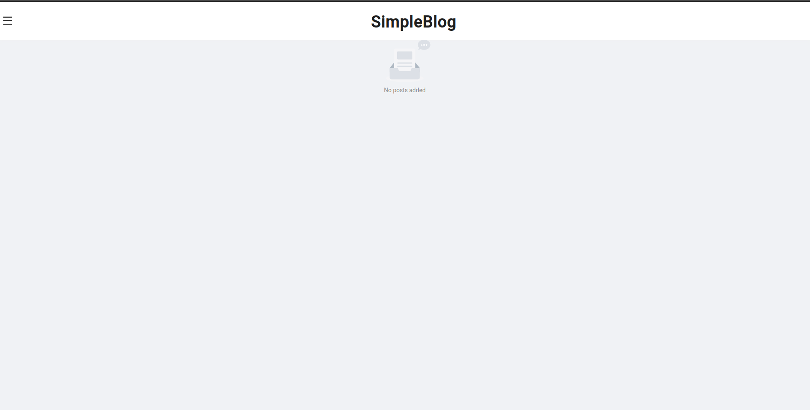

1. **Add a new post**

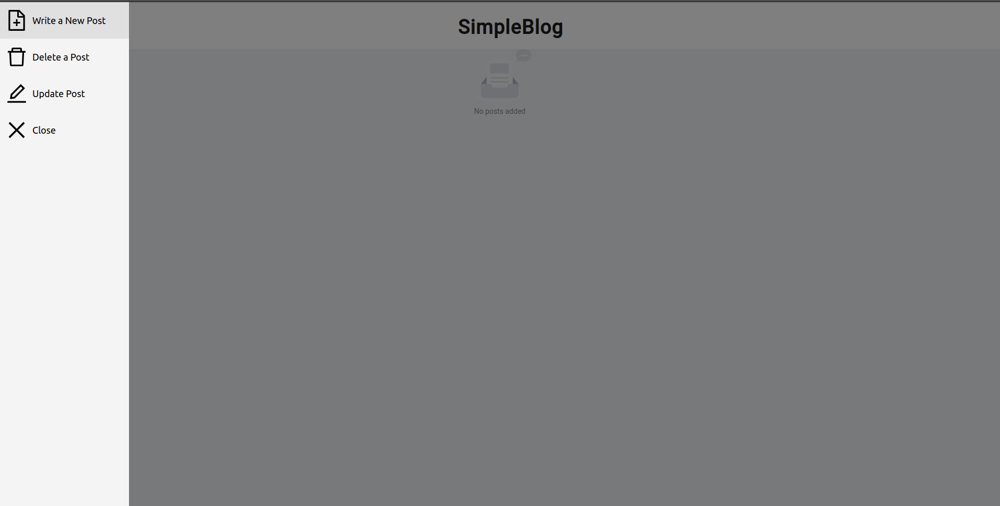

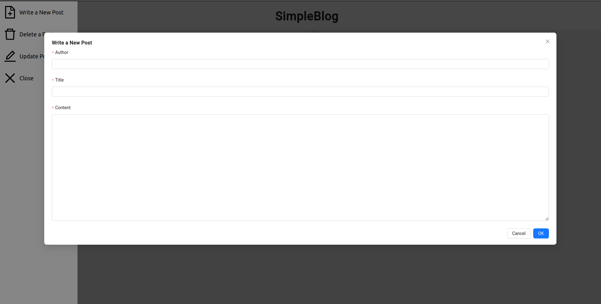

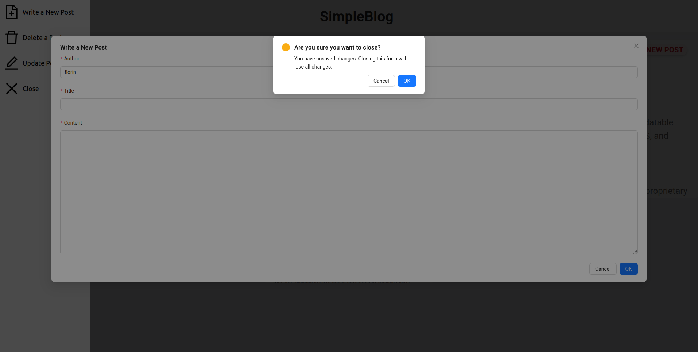

2. **Homepage**

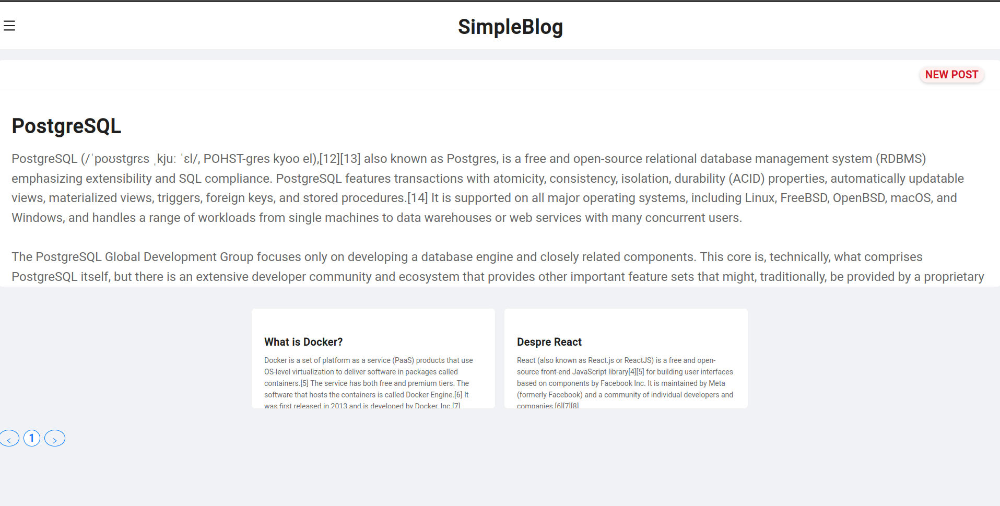

3. **View a post**

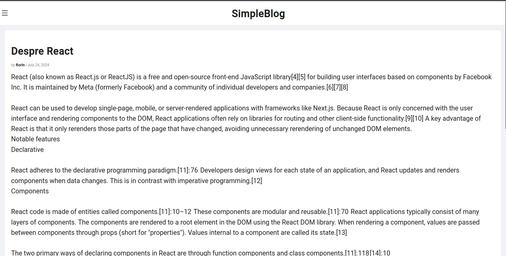

4. **Update post**

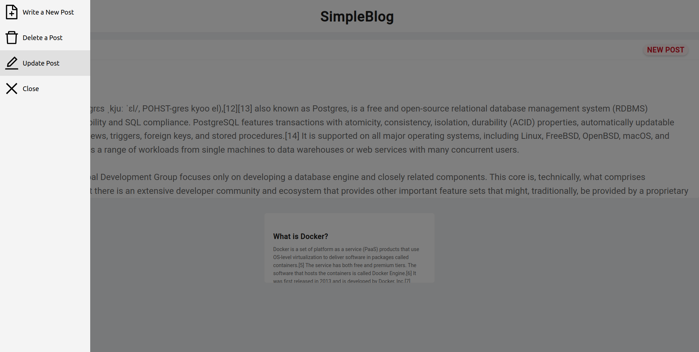

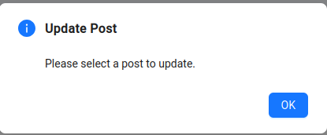

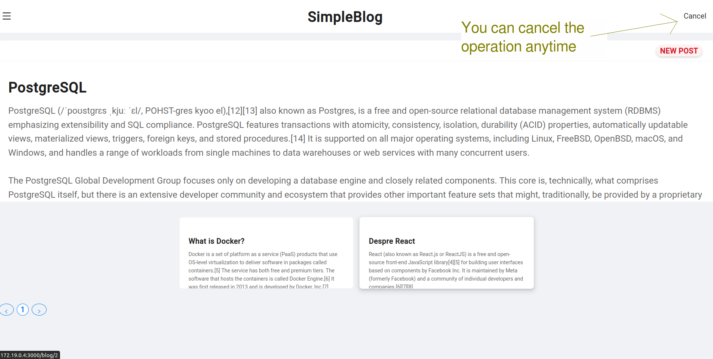

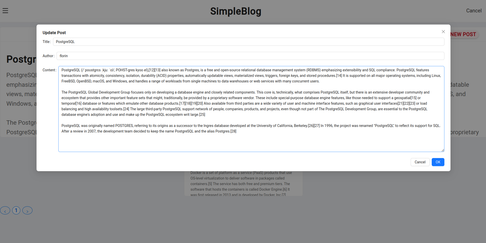

5. **Delete post**

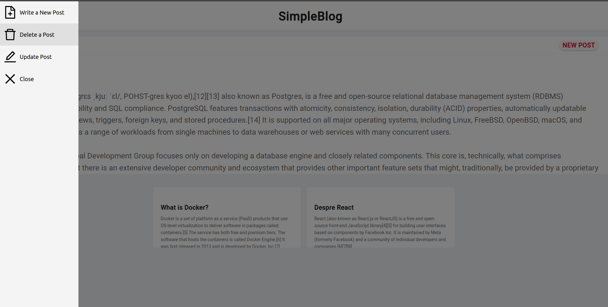

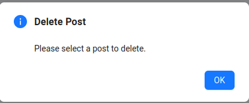


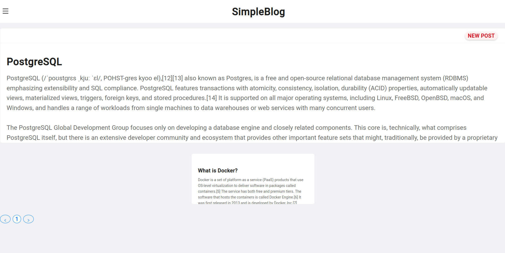

